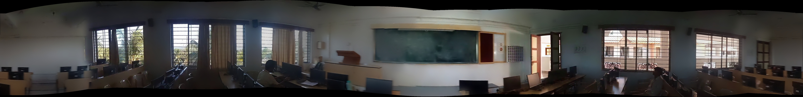

# 360° Environment Perception and Interpretation

## Overview
A web application for creating 360° panoramic images from video input, performing object detection, and generating descriptive text for navigation and room atmosphere. Built with Flask for the backend, OpenCV for panorama stitching, SAHI and YOLOv8 for object detection, and Gemma 3 12B for text generation. The frontend uses HTML, CSS, and JavaScript for a responsive user interface.

## Screenshots

**Upload Interface**: Interface for uploading a video to generate a panorama  


**Stitched Panorama**: 360° panorama created from the uploaded video  


**Object Detection without SAHI**: Object detection results using baseline YOLOv8x model  


**Object Detection with SAHI**: Object detection results using fine-tuned model with SAHI slicing  


**Exit Instructions**: Text instructions for navigating to the room's exit  


**General Room Description and Atmosphere**: Text description of the room’s layout and ambiance  


**Detection and Description Interface**: Interface showing comparison of object detection results and Gemma 3 responses for navigation 


## Features
- **Video to Panorama**: Extracts frames from an uploaded video and stitches them into a 360° panorama.
- **Object Detection**: Performs object detection with and without SAHI slicing using YOLOv8x and a fine-tuned model (`best.pt`).
- **Text Generation**: Generates clear exit instructions and a general room description using Gemma 3 12B via Ollama.
- **Responsive UI**: Displays panorama, detection results, and text descriptions in a clean, user-friendly interface.
- **Progress Feedback**: Shows a loading spinner and status messages during processing.

## Benefits for Visually Impaired Users
- **Enhanced Navigation**: Provides clear, step-by-step auditory instructions to guide users to exits, using detected objects as landmarks, enabling safe navigation in unfamiliar indoor environments.
- **Improved Environmental Awareness**: Converts 360° panoramic views into detailed verbal descriptions of the room’s layout and atmosphere, helping users understand their surroundings without visual input.
- **Increased Independence**: Empowers visually impaired individuals to navigate complex settings autonomously, reducing reliance on external assistance and boosting confidence.
- **Accurate Object Detection**: Leverages SAHI-enhanced YOLOv8 to detect objects in crowded or occluded scenes, ensuring reliable identification of obstacles and landmarks critical for safe movement.
- **Real-Time Feedback**: Delivers immediate auditory cues via a client-server architecture, allowing users to react promptly to dynamic changes in their environment.

## Tech Stack
- HTML, CSS, JavaScript for frontend
- Flask for backend
- OpenCV for video frame extraction and panorama stitching
- SAHI and YOLOv8 for object detection
- Transformers (BLIP) for image captioning
- Gemma 3 12B (via Ollama) for text generation
- NumPy for image processing
- Python 3.8+

## Prerequisites
- Python 3.8+
- YOLOv8 model (`yolov8x.pt`) and fine-tuned model (`best.pt`)
- Ollama installed with Gemma 3 12B model
- Modern web browser (Chrome recommended)
- CUDA-enabled GPU (optional, for faster object detection)
- Dependencies: Flask, OpenCV, NumPy, Transformers, Torch, Torchvision, SAHI, Ultralytics, Requests

## Installation
1. Clone the repository:
   ```bash
   git clone https://github.com/your-repo/360-environment-perception && cd 360-environment-perception
   ```
2. Install Python dependencies:
   ```bash
   pip install flask opencv-python numpy transformers torch torchvision ultralytics sahi requests
   ```
3. Download YOLOv8 model:
   - Place `yolov8x.pt` and `best.pt` in the project directory.
4. Set up Ollama:
   - Install Ollama and pull the Gemma 3 12B model:
     ```bash
     ollama pull gemma3:12b
     ```
   - Ensure Ollama is running on `http://localhost:11434`.
5. Create required directories:
   ```bash
   mkdir -p static/uploads static/output
   ```
6. Run the Flask application:
   ```bash
   python app.py
   ```
7. Visit: `http://localhost:5000`

## Structure
```
├── static/
│   ├── uploads/               # Stores uploaded videos
│   ├── output/                # Stores panoramas and detection results
│   ├── css/
│   │   └── style.css          # Custom styles
├── templates/
│   └── index.html             # Main webpage
├── images/                    # Screenshots for README
├── app.py                     # Flask backend
├── script.js                  # Client-side JavaScript logic
└── README.md
```

## Usage
1. **Upload Video** (`index.html`):
   - Navigate to `http://localhost:5000`.
   - Upload a video file using the upload form.
2. **Panorama Generation**:
   - The system extracts frames and stitches them into a 360° panorama, displayed briefly.
3. **Object Detection and Text Generation**:
   - After 5 seconds, the panorama is replaced with object detection results (with and without SAHI).
   - Exit instructions and a general room description are generated and displayed below.
4. **View Results**:
   - Object detection images show detected objects with bounding boxes.
   - Text sections provide navigation instructions and a room description.

## Endpoints
- **GET /**: Serves the main page (`index.html`).
- **POST /upload**: Processes the uploaded video and returns the panorama URL.
- **GET /object_detection**: Performs object detection and generates text descriptions, returning image URLs and text.
- **GET /static/output/<filename>**: Serves output files (panoramas, detection images).

## Notes
- **Model Weights**: Ensure `yolov8x.pt` and `best.pt` are available in the project directory. `best.pt` should be fine-tuned for the target environment.
- **Ollama**: The Gemma 3 12B model must be running via Ollama for text generation.
- **Performance**: Object detection with SAHI is slower but more accurate due to slicing. Adjust `slice_height` and `slice_width` in `app.py` for performance vs. accuracy trade-offs.
- **GPU Support**: Use `cuda:0` for faster detection if a compatible GPU is available; otherwise, switch to `cpu` in `app.py`.
- **Error Handling**: The UI displays alerts for errors (e.g., failed panorama stitching or missing models).
- **Flask Debug Mode**: The app runs in debug mode for development. Use a production server (e.g., Gunicorn) for deployment.

## Contributing
Fork the repository, create a branch, commit changes, and submit a pull request.
